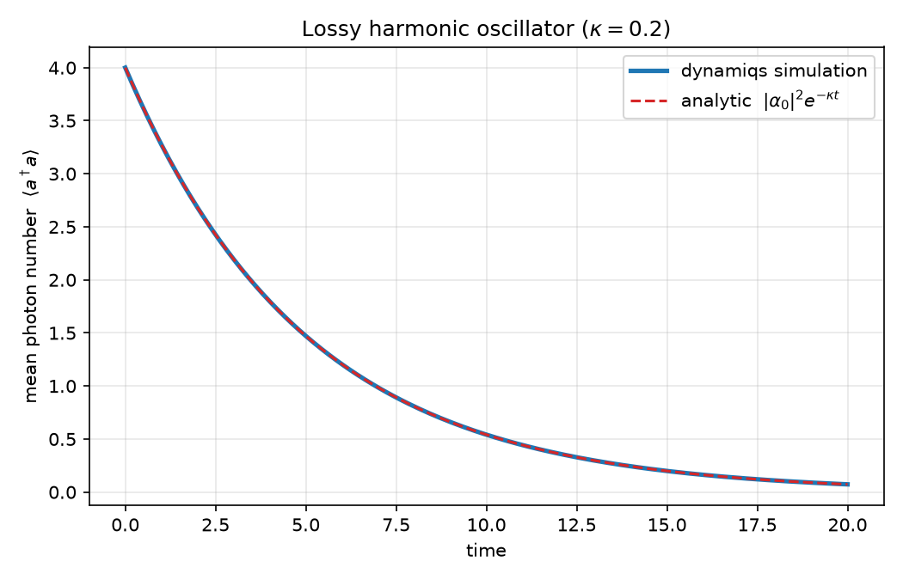

# qubit-playground

Open-quantum-system simulation playground using
[dynamiqs](https://github.com/dynamiqs/dynamiqs)/[JAX](https://github.com/jax-ml/jax).
The repository contains a simple example of a cat qubit simulation, and its meant to
represent a clean, self-contained, and friendly introduction.

## Hello cat qubit — lossy harmonic oscillator

A single cavity mode with Hamiltonian `H = ω a†a` under single-photon loss
(jump operator `√κ a`) obeys the Lindblad master equation. Starting from a
coherent state `|α₀⟩`, the mean photon number decays purely exponentially:

```
⟨a†a⟩(t) = |α₀|² · exp(−κ·t)
```

The dynamiqs simulation (`dq.mesolve`) reproduces this to within a maximum
absolute error of ~5e-6 over the full time window:



## Setup

Requires Python 3.11+ and [uv](https://github.com/astral-sh/uv).

```bash
uv sync                                                    # create env, install deps
uv run python -m qubit_playground.plot_lossy_oscillator   # regenerate the figure
```

## Layout

```
src/qubit_playground/
  lossy_oscillator.py       # model + simulation, analytic reference, error metric
  plot_lossy_oscillator.py  # figure generation + validation report
figures/                    # generated plots
```

## Status

Ongoing development. See the commit history for the running trajectory.
