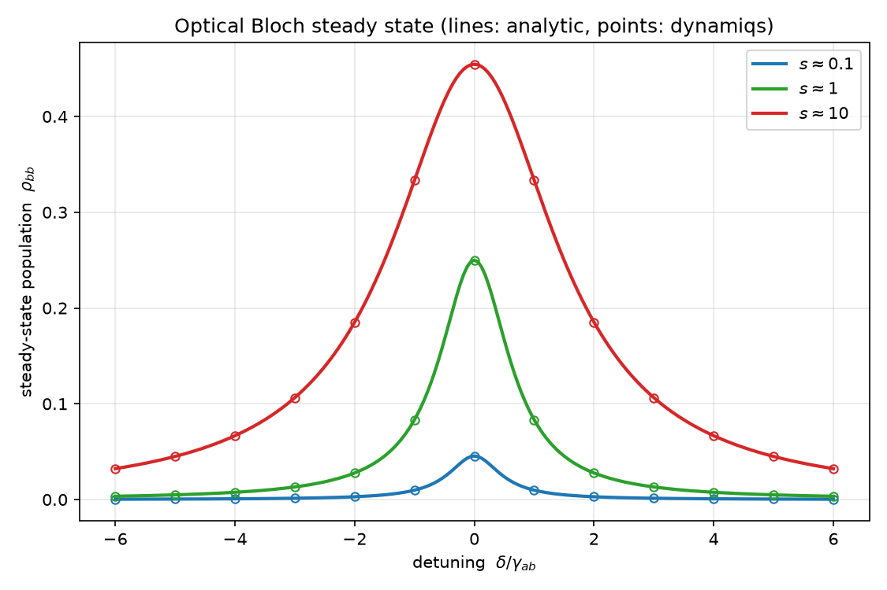
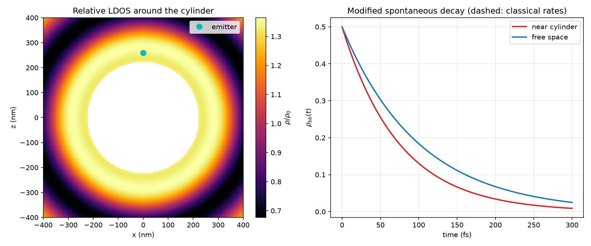
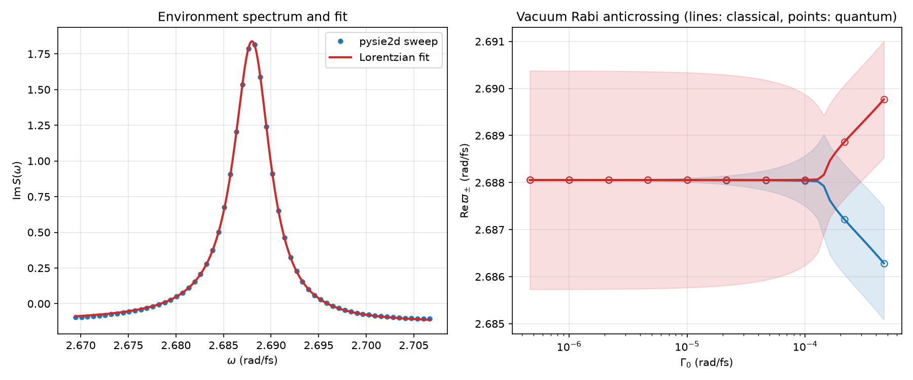

# qubit-playground


Hands-on studies of differentiable simulations of open quantum systems with
[dynamiqs](https://github.com/dynamiqs/dynamiqs)/[JAX](https://github.com/jax-ml/jax).
Current content: a validated lossy harmonic oscillator; see [Roadmap](#roadmap).

## The lossy harmonic oscillator

Single-mode cavity Hamiltonian `H = ω a†a` under single-photon loss `√κ a` 
that obeys the Lindblad master equation. For a
coherent state `|α₀⟩`, the mean photon number decays purely exponentially a
```
⟨a†a⟩(t) = |α₀|² · exp(−κ·t)
```


The dynamiqs simulation (`dq.mesolve`) reproduces this to within a maximum
absolute error of ~5e-6 over the full time window. 
Numerical agreement is enforced by the CI test suite.

## Light–matter interaction: coupling a Maxwell solver to the master equation

The light_matter subpackage evolves the Lindblad master equation and uses pysie2d(https://github.com/claudio-sc/pysie2d), a fast Maxwell solver to provide classical driving fields in inhomogeneous environments.

Theoretical details of the semiclassical model can be found in the tutorial by 
Bouchet & Carminati (2019).

The self-term of the 2D **dressed propagator** `S(r_s, r_s, ω)` is 
calculated near a dielectric structure. This represents a classical nanowire emitter, 
and is the classical output that drives quantum master-equation simulations in dynamiqs. 

**pysie2d**'s dimensionless `S` has vacuum `Im g₀(r→r) = 1/4`. Preserving vacuum consistency
gives the physical response `S̃(ω) = 2·Γ₀·S(ω)`, from which the paper's §4 carries
over verbatim. This is pinned by an exact identity (`rtol=1e-12` in CI):

```
decay_rate / Γ₀  ==  1 + 4·Im S  ==  pysie2d.relative_ldos
```

Data flows strictly one way:
pysie2d (NumPy) → plain floats/arrays → dynamiqs (JAX).

**Three results, three figures.**

1. **Optical Bloch equations** — a driven three-level emitter solved as a
   Lindblad master equation, validated against the paper's analytic steady
   state including power broadening.

   

2. **Weak coupling / Purcell effect** — the emitter's decay rate and frequency
   shift modified by a nearby cylinder. *Honesty bar:* here the quantum
   simulation **consumes** the classically computed rates; the physics content
   is the bridge normalization, not an independent prediction.

   

3. **Strong coupling / vacuum Rabi splitting** — a Lorentzian fit of the
   classically computed `S(ω)` near an isolated whispering-gallery resonance
   yields the mode `(ω_m, γ_m)` and coupling `g`; an **independent**
   Jaynes–Cummings simulation then reproduces the classically predicted
   polariton eigenfrequencies for *both* branches. This is the headline:
   *a classical Maxwell solver predicts the eigenfrequencies of a strongly
   coupled emitter–resonator system, and an independent quantum master-equation
   simulation reproduces them* (agreement to `rtol=1e-3` in CI, observed ~1e-15).

   

**Scenario layer.** There are no hard-coded parameters in the package. Instead, a
declarative TOML configuration strategy is adopted. 
Geometry, material, emitter, and time window parameters live in toml files.
This allows parsing and validation. 
Test runs of each scenario (physical system configuration) enforce numerical matches to
predefined references. 
One classical sweep takes minutes in single-core execution.
The results then can serve an unlimited number of
quantum experiments (milliseconds each), and gives the Γ₀-sweep
anticrossing calculation nearly for free.

In order to regenerate the three figures:

```bash
uv run python -m qubit_playground.light_matter.plot_bloch
uv run python -m qubit_playground.light_matter.plot_purcell
uv run python -m qubit_playground.light_matter.plot_strong_coupling
```

## Setup

Requires Python 3.12+ and [uv](https://github.com/astral-sh/uv).

```bash
uv sync                                                    # create env, install deps
uv run python -m qubit_playground.plot_lossy_oscillator   # regenerate the figure
uv run pytest                                              # run the test suite
```

## Layout

```
src/qubit_playground/
  lossy_oscillator.py       # model + simulation, analytic reference, error metric
  plot_lossy_oscillator.py  # figure generation + validation report
  light_matter/             # classical-to-quantum bridge (Bouchet & Carminati 2019)
    units.py                # nm/fs unit system
    fitting.py              # matrix-pencil + Lorentzian estimators
    emitter.py              # three-level emitter + analytic steady state
    bloch.py                # optical Bloch equations (dynamiqs)
    scenarios.py            # declarative TOML solver configs + loader
    scenarios/*.toml        # circle_weak, circle_wgm (provenance-carrying)
    environment.py          # S(ω) spectrum, bridge normalization, mode fit
    purcell.py              # weak-coupling modified decay
    strong_coupling.py      # Jaynes–Cummings, quantum vs classical eigenfrequencies
    plot_*.py               # three figure drivers
tests/                      # analytic, decay-rate, truncation, and plot tests
  light_matter/             # mirrors the subpackage; shared conftest fixtures
figures/                    # generated plots
```

## Roadmap

- Fock-space and cat-state studies.
- Semiclassical light–matter module driven by an external 2-D EM solver — **done**
  (optical Bloch, Purcell, strong coupling; see above).
- Two emitters through the environment: cross Green function G₁₂, super- and
  subradiance (Bouchet & Carminati §5).
- Quasinormal-mode input: Beyn eigensolver (pysie2d v0.3) feeding
  `PhotonicMode.from_qnm`, cross-validated against the Lorentzian fit.

## References

- A. Bouchet and R. Carminati, "Quantum dipole emitters in structured
  environments: a scattering approach: tutorial," *J. Opt. Soc. Am. A* **36**,
  186 (2019). DOI [10.1364/JOSAA.36.000186](https://doi.org/10.1364/JOSAA.36.000186).
- [pysie2d](https://github.com/claudio-sc/pysie2d) — the 2-D boundary-integral
  scattering solver providing the classical electromagnetic environment response.
